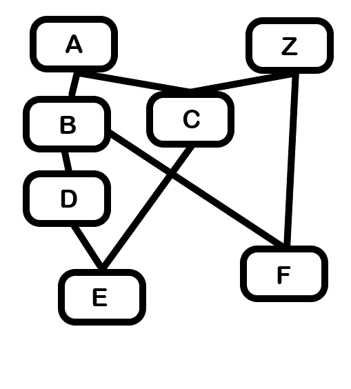

# HomeWork-5

## سوال ۱
### الف
در مقایسه دیفالت لیست ها می توان گفت که کدی به شکل زیر است
``` python
def __eq__(self, other):
    for i in self:
        if self[i] != other[i]:
            return False
    return True
```
و برای بقیه مقایسه ها نیز همینطور است

### ج
این ویژگی را ندارد


## سوال ۲
### الف
گراف به شکل زیر است

### ب
از کلاس آن یک ام آر او میگیریم

‍‍‍``` (<class '__main__.E'>, <class '__main__.D'>, <class '__main__.B'>, <class '__main__.C'>, <class '__main__.A'>, <class '__main__.Z'>, <class 'object'>)```
به ترتیب

### ج
در ارور بخاطر این است که تابع دو جاب دو ورودی می گیرد ولی ما ۳ تا برای آن در نظر گرفتیم. باید در هنگام هندل کردن متغییر هایی که پاس می دهیم مراقب این باشیم

---